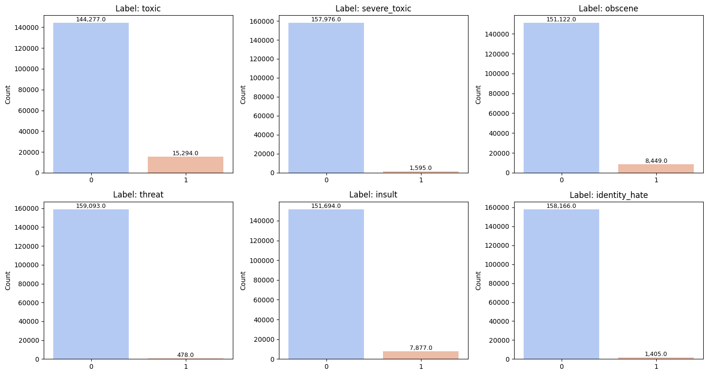
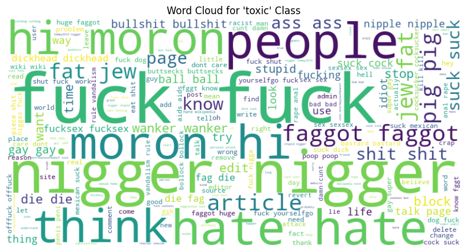
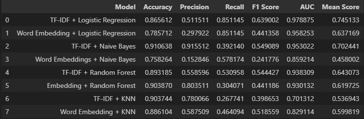
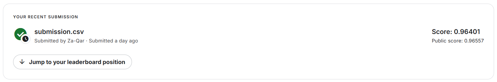

# Toxic Comment Classification

A multi-label NLP classification project on the Kaggle toxic comments dataset, comparing classic ML models with **TF-IDF** and **word embedding** feature pipelines.

## Project Goal
Detect toxic comment categories (`toxic`, `severe_toxic`, `obscene`, `threat`, `insult`, `identity_hate`) and benchmark model/feature combinations for robust moderation performance.

## Pipeline Summary
- Data cleaning with regex + spaCy tokenisation
- Sentiment features via TextBlob (polarity + subjectivity)
- Feature extraction:
  - TF-IDF (uni/bi-grams)
  - Word embedding vectors
- Multi-label training/evaluation with:
  - Logistic Regression
  - Naive Bayes
  - Random Forest
  - K-Nearest Neighbours
- Metrics: Accuracy, Precision, Recall, F1, AUC, and mean score comparison

## Key Results
- Best overall mean score in model comparison table: **TF-IDF + Logistic Regression** (`0.745`)
- Strongest Kaggle submission reported: **public score `0.96557`** (LR + TF-IDF)
- The dataset is strongly imbalanced across labels, which impacts rare-class detection

## Visuals
| Label balance | Toxic-class word cloud |
|---|---|
|  |  |

| Model metrics comparison | Kaggle submission score |
|---|---|
|  |  |

## Tech Stack
- `Python`
- `pandas`, `numpy`
- `scikit-learn`, `gensim`
- `spaCy`, `TextBlob`, `nltk`
- `matplotlib`, `seaborn`, `wordcloud`

## Run
1. Install dependencies:

```bash
pip install -r requirements.txt
```

2. Open and run the notebook:

```bash
jupyter notebook toxic_comment_classification_03.ipynb
```

## Files
- `toxic_comment_classification_03.ipynb` - full data pipeline, modelling, evaluation, and submission workflow
- `CSCK507 - Mid module assignment - Zaid Qarout.doc` - report
- `assets/` - extracted report figures used above

## Note
This is an academic NLP assignment focused on comparative modelling and practical evaluation for toxic content detection.
